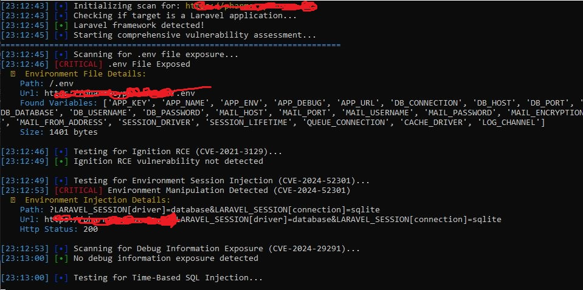
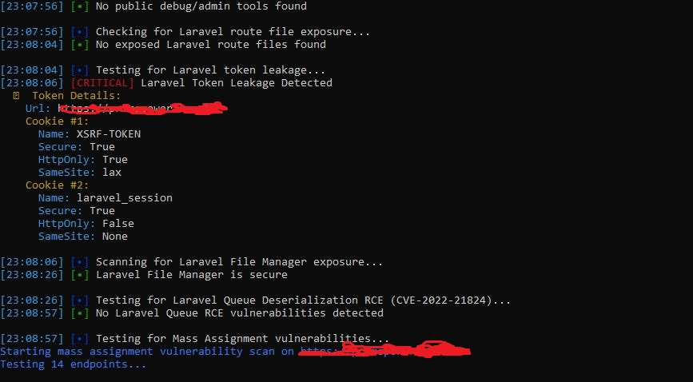
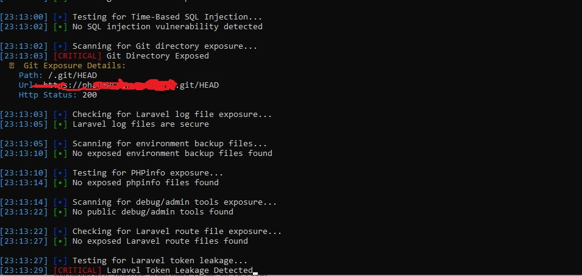

# Laravel Vulnerability Checker

A simple Laravel vulnerability scanner for CVEs and common misconfigurations. This tool performs comprehensive security assessment of Laravel applications by testing for known vulnerabilities and security misconfigurations.

## Features

- **Automated Laravel Detection** - Verifies target is running Laravel framework
- **16 Security Checks** - Comprehensive vulnerability assessment including:
  - CVE-2021-3129 (Laravel Ignition RCE)
  - CVE-2024-52301 (Environment Variable Manipulation)
  - CVE-2024-29291 (Debug Information Exposure)
  - CVE-2022-21824 (Queue Deserialization RCE)
  - Environment file exposure (.env)
  - Git directory exposure
  - Laravel log file exposure
  - PHP Object Injection vulnerabilities
  - Time-based SQL injection
  - Mass assignment vulnerabilities
  - Token leakage analysis
  - Laravel File Manager exposure
  - PHPinfo exposure
  - Route file exposure
  - Environment backup file exposure

- **Color-coded Output** - Easy-to-read results with severity indicators
- **Detailed Reporting** - Comprehensive vulnerability details and recommendations
- **Professional Grade** - Suitable for penetration testing and security audits

## Screenshots


*Initial Laravel detection and scanning process*


*Vulnerability detection with detailed analysis*


*Vulnerability detection with detailed analysis*

### Prerequisites

- Python 3.6 or higher
- pip package manager

### Install Dependencies
```bash
pip install -r requirements.txt
```bash
git clone https://github.com/codebyebrahim/laravel-vuln-checker.git
cd laravel-vuln-checker
pip install -r requirements.txt
## Example Output
══════════════════════════════════════════════════════════════════════
                                                                                             
    ██╗      █████╗ ██████╗  █████╗ ██╗   ██╗███████╗██╗                           
    ██║     ██╔══██╗██╔══██╗██╔══██╗██║   ██║██╔════╝██║                           
    ██║     ███████║██████╔╝███████║██║   ██║█████╗  ██║                           
    ██║     ██╔══██║██╔══██╗██╔══██║╚██╗ ██╔╝██╔══╝  ██║                           
    ███████╗██║  ██║██║  ██║██║  ██║ ╚████╔╝ ███████╗███████╗                      
    ╚══════╝╚═╝  ╚═╝╚═╝  ╚═╝╚═╝  ╚═╝  ╚═══╝  ╚══════╝╚══════╝                      
                                                                                             
              VULNERABILITY SCANNER                           	      
                                                                                             
         Developed by: CodeByEbrahim                                                
         GitHub: github.com/codebyebrahim                                      
         Scan Date: 2025-01-22 15:30:45          
                                                                                             
    Laravel Security Assessment Tool                               
                                                                                             
══════════════════════════════════════════════════════════════════════

[15:30:45] [•] Initializing scan for: https://target.com
[15:30:46] [•] Checking if target is a Laravel application...
[15:30:47] [•] Laravel framework detected!
[15:30:47] [•] Starting comprehensive vulnerability assessment...

[15:30:48] [CRITICAL] .env File Exposed
📍 Environment File Details:
  Path: /.env
  Url: https://target.com/.env
  Found Variables: APP_KEY, DB_PASSWORD, MAIL_PASSWORD
  Size: 1247 bytes

[15:30:50] [•] Ignition RCE vulnerability not detected
[15:30:52] [•] Environment session injection not detected
...
```
---

## 🔍 Vulnerability Modules

The scanner includes the following security modules:

| Module                       | CVE/Type              | Description                                     |
|------------------------------|-----------------------|--------------------------------------------------|
| `detect_laravel.py`          | Framework Detection   | Identifies Laravel applications                  |
| `cve_2021_3129.py`           | CVE-2021-3129         | Laravel Ignition RCE vulnerability               |
| `cve_2024_52301.py`          | CVE-2024-52301        | Environment variable manipulation                |
| `cve_2024_29291.py`          | CVE-2024-29291        | Debug information exposure                       |
| `queue_deserialization_rce.py` | CVE-2022-21824      | Queue deserialization RCE                        |
| `env_exposure.py`            | Configuration         | Environment file exposure                        |
| `git_exposure.py`            | Info Disclosure       | Git directory exposure                           |
| `log_exposure.py`            | Info Disclosure       | Laravel log file exposure                        |
| `debug_tools_exposure.py`    | Misconfiguration      | Debug tools exposure                             |
| `deserialization_poi.py`     | Code Injection        | PHP Object Injection                             |
| `sqli_time_api.py`           | SQL Injection         | Time-based SQL injection                         |
| `mass_assignment_checker.py` | Input Validation      | Mass assignment vulnerabilities                  |
| `token_leakage.py`           | Session Security      | Token security analysis                          |
| `laravel_filemanager_exposure.py` | Access Control   | File manager exposure                            |
| `phpinfo_exposure.py`        | Info Disclosure       | PHPinfo exposure                                 |
| `routes_exposure.py`         | Info Disclosure       | Route file exposure                              |
| `env_backup_exposure.py`     | Configuration         | Environment backup exposure                      |

---

## 🛠 Security Assessment Process

1. **Laravel Framework Detection** - Verifies if the target is a Laravel application  
2. **Environment File Scanning** - Checks for exposed `.env` files  
3. **CVE Testing** - Tests for known Laravel vulnerabilities  
4. **Configuration Analysis** - Identifies misconfigurations  
5. **Information Disclosure** - Detects exposed sensitive files  
6. **Injection Testing** - SQL injection and object injection tests  
7. **Access Control** - Verifies proper access controls  
8. **Token Security** - Analyzes session and CSRF token handling  

---
## ⚖️ Legal Disclaimer

⚠️ **Important:**  
This tool is intended **only** for educational purposes and **authorized** security testing.

By using this tool, you agree to:

- Have **explicit permission** to test the target systems  
- Use it only for **learning or authorized penetration testing**  
- **Comply with applicable laws and regulations**  
- **Not** use it for unauthorized access or malicious purposes  

The author is **not responsible** for any misuse of this tool.

---

## 🤝 Contributing

Contributions are welcome! Feel free to:

- Report bugs and issues  
- Suggest new vulnerability modules  
- Submit pull requests  
- Improve documentation  

---

## 📄 License

This project is licensed under the **MIT License**.  
See the `LICENSE` file for more information.

---

## 👨‍💻 Author

**CodeByEbrahim**  

---

## 🙏 Acknowledgments

- Laravel Security Documentation  
- OWASP Testing Guide  
- CVE Databases and Security Researchers  

---

⭐ **Star this repository if you find it useful!**
